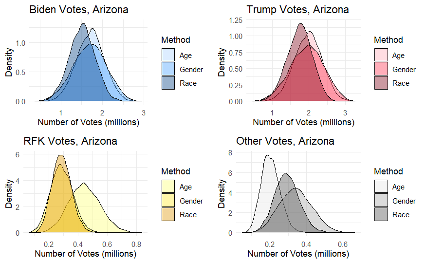
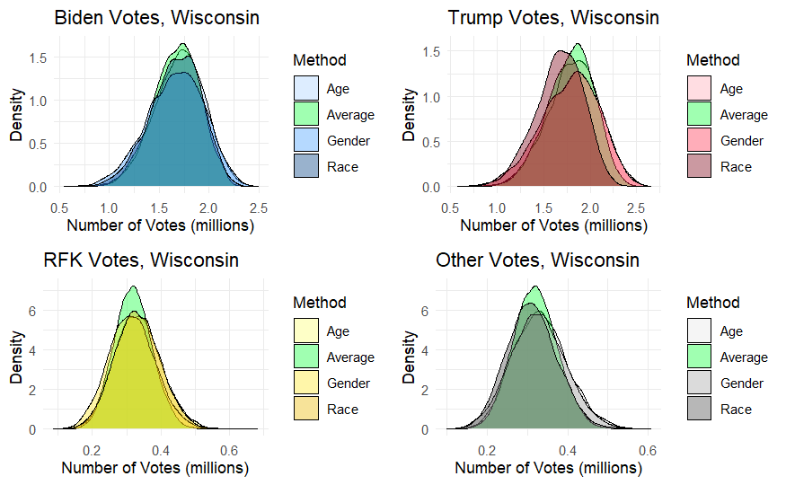
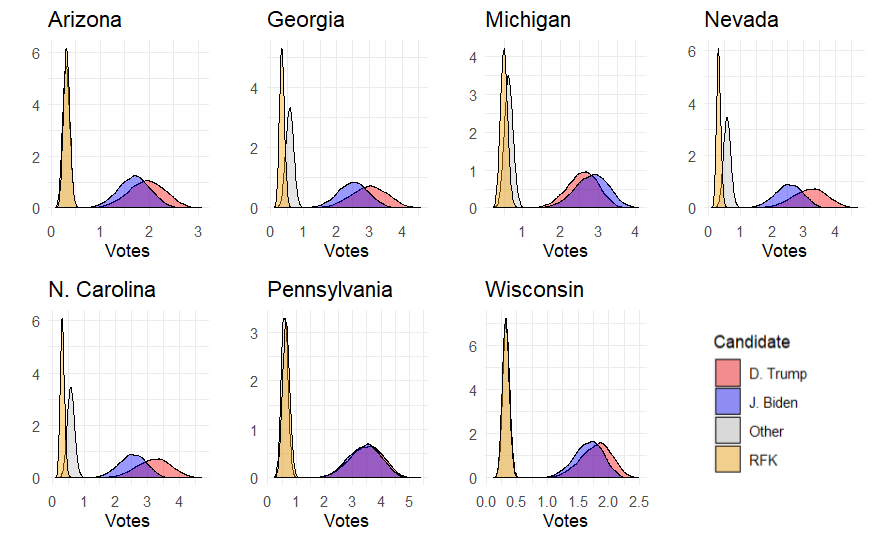

# A Bayesian Approach for Combining Stratified Election Polls

This repository contains the explanation and application of a Bayesian statistical method I developed to interpret the results of demographic-stratified election polls. The main format of my project is the attached pdf, but I thought it would be useful to upload support for the paper by including the script used to generate my analysis, along with the formatted data I used as input. 

### Contents

The full report is available as [Zalewski_Bayesian_Polling.pdf](./Zalewski_Bayesian_Polling.pdf), and contains the following sections:

1. Introduction
    - Stratified Election Polling
    - Bayesian Model Averaging
    - Challenges of US Election Polls
2. A Bayesian Model for Interpreting Polls
3. Data Collection
    - Polls
    - Voter Turnout Rate
    - Population
4. Model Fitting
5. Results
6. Discussion

If you'd like to see the exact code used alongside the paper, including the STAN model, the file [zalewski_bma_polling.Rmd](./zalewski_bma_polling.Rmd) contains the entire script used in the analysis. Although the sections are clearly marked, annotations are sparse as they assume familiarity with what the purpose of the script as explained throughout the paper. The [data](./data) folder contains all the necessary files necessary to run the script, and these files should be placed in the directory of the markdown file when executed.

## Methodology Summary

Using historical census data for voter turnout and recent polls surveying the 2024 US presidential election, I constructed three seperate models to estimate the quantity of recieved votes for each candidate of the form:

$$ V_{sk} = \sum_{d \in D} \phi_{sd} \cdot \theta_{sdk} \cdot p_{sd}$$

Where $\phi_{sd}$ is the turnout rate for demographic $d$ in state $s$, and $\theta_{sd}$ is the proportion of demographic $d$ in state $s$ voting for candidate $k$. With this formulation, I created three different models which stratified by different demographic groups to reduce bias in their estimations: by gender, race, and age groups. I strongly recommened reading section 2 of the report for a more detailed description of assumptions and prior distributions for each of the model parameters.

Using MCMC sampling, the posterior distributions for each of these models are calculated. Here are the three models compared for four different voting options in Arizona:

As you can see, the level of agreement in these model estimates are varying, with some predictions overlapping significantly, and others having significantly different peaks. Using Bayesian model averaging (BMA), I take the average of each of the three models, using the model's marginal likelihood as weights for the summation. This allows agreeing models to narrow down prediction intervals with compiled information and disagreeing models to generate meaningful compromise, all guided by the likelihood of the models.

These improved BMA models are shown below along the single-demographcic stratified models, showing the higher peaks and narrower intervals in green:

With a finalized BMA model, I generated posterior distributions for a select group of states with the most contentious election polling:

Which then could be translated into 90% credible intervals for each state. Here are the credible intervals of Wisconsin, for example:

| Model  | Biden         | Trump         | RFK           | Other         |
|--------|---------------|---------------|---------------|---------------|
| Gender | [1.16, 2.10]  | [1.23, 2.26]  | [0.21, 0.43]  | [0.21, 0.44]  |
| Race   | [1.21, 2.05]  | [1.20, 2.06]  | [0.22, 0.44]  | [0.21, 0.42]  |
| Age    | [1.27, 2.10]  | [1.34, 2.26]  | [0.23, 0.45]  | [0.23, 0.45]  |
| BMA    | [1.26, 2.03]  | [1.35, 2.17]  | [0.23, 0.41]  | [0.24, 0.42]  |

In each instance, my BMA model was able to create estimations with a narrower 90% credible interval than from any of the single-demographic stratified models. In my paper, I take these BMA posterior distributions further, incorporating of the electoral college in the MCMC sampling process to create interpretations of the final 2024 election outcome.

## Contact

Sam Zalewski - samzalewski@yahoo.com
Project Link - [https://github.com/detective-sticks/bma-polling]([./Zalewski_Bayesian_Polling.pdf](https://github.com/detective-sticks/bma-polling))

